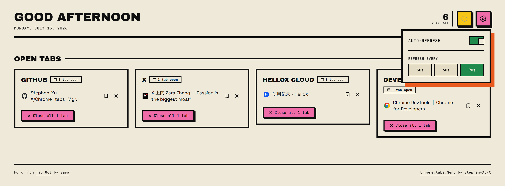

# Tabs Mgr.

本地运行的 Chrome 新标签页管理面板。

## Fork 声明

本项目 Fork 自 [zarazhangrui/tab-out](https://github.com/zarazhangrui/tab-out)，在其基础上进行界面与功能定制。

## 自定义修改

- 使用仓库内 [Theme/design.md](Theme/design.md) 作为界面设计规范：奶油底色、黑色结构边框、硬阴影和直角组件
- 顶部提供打开标签计数、手动刷新和自动刷新设置
- 自动刷新支持 `30s`、`60s`、`90s`，仅刷新标签面板，不重载网页
- 打开标签按真实 Chrome tab ID 逐个显示，相同 URL 不再被折叠
- 标签 favicon 使用 Chrome 数据；保存和归档列表会保留 favicon
- `Save for later` 支持归档、搜索和清空已归档项目
- 修复 Manifest V3 对内联事件处理器的 CSP 报错
- 页脚保留原项目归属，并标注当前 fork 作者

## 使用方式

1. 下载 Release 中的 `Tabs-Mgr-2.0.zip` 并解压。
2. 打开 `chrome://extensions`。
3. 开启右上角的开发者模式。
4. 点击“加载已解压的扩展程序”，选择解压目录中的 `extension` 文件夹。
5. 新建一个标签页即可使用。

## License

本项目沿用上游 Tab Out 的 [MIT License](LICENSE)。

## Stars

